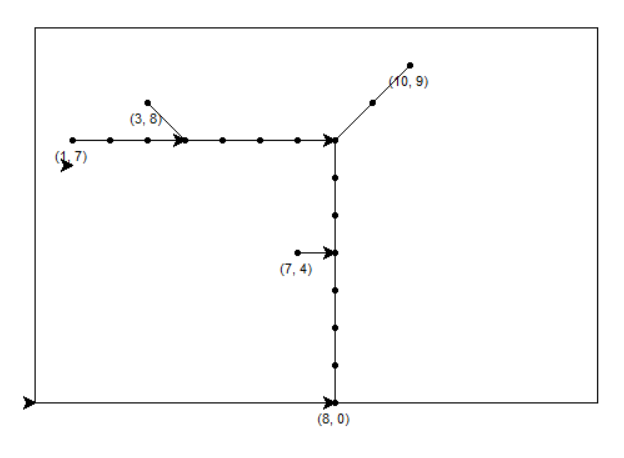

# Sewage system with Turtle

## Table of Contents
* [General info](#general-info)
* [Technologies](#technologies)
* [Setup](#running)

## General info


Sewage System Route Generator calculates the total length and depth 
of pipes for installation and generate pipeline routes with turtle. 
The generator is based on the A* algorithm.
Input data are kept in points.csv.
Mandatory structure of the file:

>15, 10,  length and width of the building
>
>x, y
>
>8, 0, last point of sewage system, need to be (x, 0)
>
>10, 9, sample point
>
>1, 5, sample point
>
> ... , rest points


Program generates routes.csv with data:
* for each point connected to the sewage system routes (point by point)
* longest route
* length
* depth


## Technologies
* turtle
* csv

## Future developent
To return dimension of pipes depending on how many points are already 
connected to main pipe and change slope of pipes.

## Running
To run this project

1. Clone this repository to your local machine:

   ```bash
   git clone -b branch_name <repository address>
   ```

2. Navigate to the project directory:

   ```bash
   cd 112_KS_design_generator
   ```

3. Create a virtual environment:

   ```bash
   python -m venv venv
   ```

4. Activate the virtual environment (on Windows):

   ```bash
   venv\Scripts\activate
   ```

5. Install dependencies:

   ```bash
   pip install -r requirements.txt
   ```

6. Run script:

   ```bash
   python main.py
   ```
   
